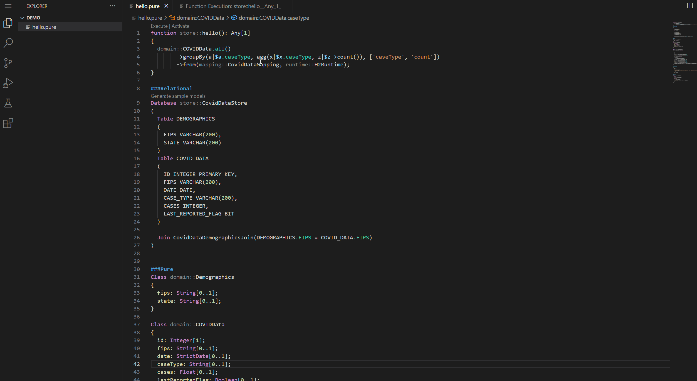

[FINOS Incubating](https://community.finos.org/docs/governance/Software-Projects/stages/incubating)

The ___Legend VSCode___ extension provides an easy and quick way to develop using _Legend_ data modeling language.  

An overview of the language can be found [here](https://legend.finos.org/docs/overview/legend-overview).

This extension leverages the [Legend LSP server](https://github.com/finos/legend-engine-ide-lsp).

For more things _Legend_, visit our GitHub [here](https://github.com/finos/legend).

## Available Features

- Parse and Compile
- Code navigation (goTo, find usage)
- Execute functions (through CodeLens commands)
- DataCube vizualization for tabular results
- Testing integration
- Legend Concept Tree
- Snippets for common element types
- Legend REPL Terminal

### Hello World

To start using the extension, create a `hello.pure` file in your workspace, and copy/paste the content of one of our showcases
- Relational Database Showcase (using in-memory H2) - https://raw.githubusercontent.com/finos/legend-studio/master/packages/legend-server-showcase-deployment/data/showcases/Stores/Relational%20Database/Mapping/code.pure
- Model to Model transformation (consume JSON input, transform to new model) - https://raw.githubusercontent.com/finos/legend-studio/master/packages/legend-server-showcase-deployment/data/showcases/Stores/Model%20Store/Mapping/code.pure

## Contributing

Visit Legend [Contribution Guide](https://github.com/finos/legend/blob/master/CONTRIBUTING.md) to learn how to contribute to Legend.

## License

Copyright 2020 Goldman Sachs

Distributed under the [Apache License, Version 2.0](http://www.apache.org/licenses/LICENSE-2.0).

SPDX-License-Identifier: [Apache-2.0](https://spdx.org/licenses/Apache-2.0)
